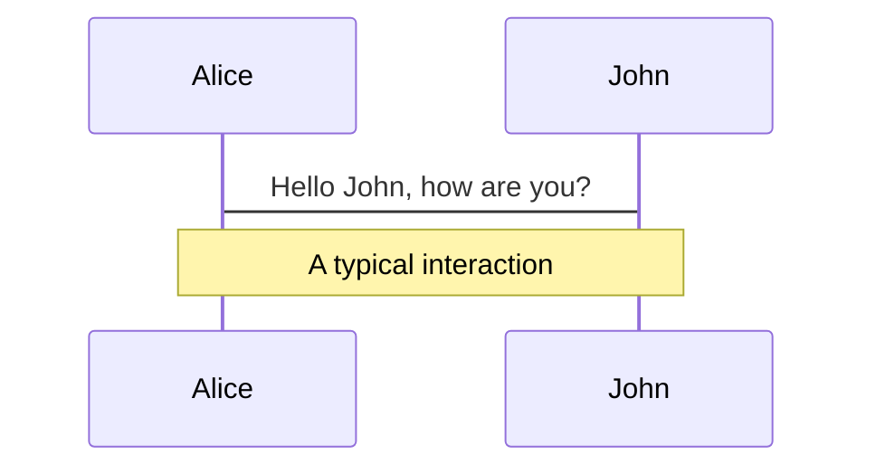
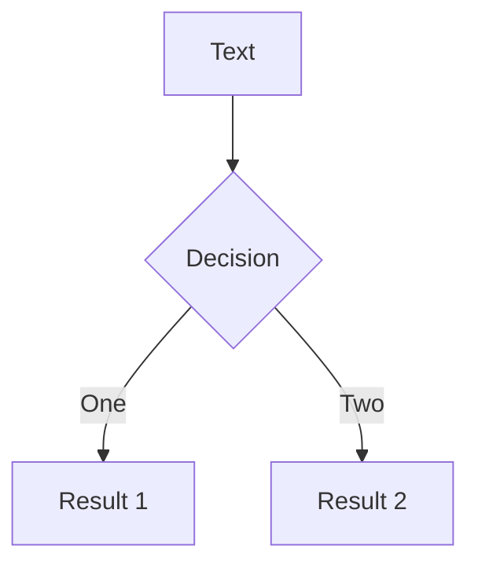

---
# try also 'default' to start simple
theme: seriph
# random image from a curated Unsplash collection by Anthony
# like them? see https://unsplash.com/collections/94734566/slidev
background: https://source.unsplash.com/collection/94734566/1920x1080
# apply any windi css classes to the current slide
class: 'text-center'
# https://sli.dev/custom/highlighters.html
highlighter: shiki
# show line numbers in code blocks
lineNumbers: false
# some information about the slides, markdown enabled
info: |
  ## Slidev Starter Template
  Presentation slides for developers.

  Learn more at [Sli.dev](https://sli.dev)
# persist drawings in exports and build
drawings:
  persist: false
---

# Welcome to Slidev

Nuxt 3, quelles nouveautés ?

<div class="pt-12">
  <span @click="$slidev.nav.next" class="px-2 py-1 rounded cursor-pointer" hover="bg-white bg-opacity-10">
    Press Space for next page <carbon:arrow-right class="inline"/>
  </span>
</div>

<div class="abs-br m-6 flex gap-2">
  <button @click="$slidev.nav.openInEditor()" title="Open in Editor" class="text-xl icon-btn opacity-50 !border-none !hover:text-white">
    <carbon:edit />
  </button>
  <a href="https://github.com/slidevjs/slidev" target="_blank" alt="GitHub"
    class="text-xl icon-btn opacity-50 !border-none !hover:text-white">
    <carbon-logo-github />
  </a>
</div>

<!--
The last comment block of each slide will be treated as slide notes. It will be visible and editable in Presenter Mode along with the slide. [Read more in the docs](https://sli.dev/guide/syntax.html#notes)
-->

---

# A propos de moi

<v-click>

- développeuse freelance front-end (Vue, Angular) en mission chez Vesperia
- instructrice LinkedIn Learning

</v-click>

<v-click>

- meetup Nuxt : https://www.meetup.com/meetup-group-nuxt/

</v-click>

---
layout: image-right
image: https://source.unsplash.com/collection/94734566/1920x1080
---

<div class="container">
  <h1 class="selected">1. Qu'est-ce que Nuxt ?</h1>
  <h1>2. Nuxt 3</h1>
</div>

<style>
.container {
  display: flex;
  flex-direction: column;
  justify-content: center;
  height: 100%;
}
.selected {
  color: #dbf5ff
}
</style>

---

# Nuxt: définition

<!-- Component usage: this will be invisible until you press "next" -->
<v-click>

- v2: "Le framework Vue intuitif"

</v-click>

<v-click>

- v3: "The Hybrid Vue Framework"

</v-click>

<v-click>

=> meta-framework basé sur Vue

</v-click>

---

# Contexte

<div style="padding: 30px 0">
<v-click>

- front-end

</v-click>

<v-click>

- SPA

</v-click>
</div>

<div>
<v-click>

Dominé par :

</v-click>

<v-clicks>

<ul>
<li>Angular</li>
<li>React</li>
<li>Vue</li>
<li class="medium">Svelte</li>
<li class="small">Riot</li>
<li class="small">Solid</li>
</ul>

</v-clicks>
</div>

<style>

.medium {
  opacity: 60%
}
.small {
  opacity: 40%
}
</style>

---

# Pourquoi des meta-frameworks ?

<v-clicks style="padding: 30px 0">

- Angular : "The modern web developer's platform" *=> langage, directory structure, UI runtime, routing, formulaires, client HTTP, tests...*
- React : "Une bibliothèque JavaScript pour créer des interfaces utilisateurs" *=> UI runtime*
- Vue : "Le Framework JavaScript Évolutif" *=> UI runtime + routing et state management non imposés*

</v-clicks>

<v-click>

=> React et Vue : grand flexibilité, mais difficultés pour bootstrap et implémentation de features clés (SSR, ...)

</v-click>

---

# Pourquoi des meta-frameworks ?

<v-clicks style="padding: 30px 0">

- React : Next, Gatsby (SSG)
- Vue : Nuxt, Quasar, Gridsome (SSG)

</v-clicks>

<v-click>

>"To me, that sounds like React is a kernel. Webpack/Create React App are bootloaders. Next.js and Gatsby are the closest things we've got to distros."
>
>James K Nelson

</v-click>

---

Questions ?

---

# Nuxt (hors v3)

Préconf
<v-clicks style="padding: 30px 0 10px 0">

- Conventions : structure de dossiers 
- Bootstrap : pré-intégration du router, de Vuex (Nuxt 2) et du **SSR**

</v-clicks>

Features ajoutées:
<v-clicks style="padding: 10px 0 10px 0">

- Expérience developpeur : routing (+ state management) par système de fichiers, auto-import des composants
- Modes de rendus : SSG, outils (hooks) *=> amélioration de **TTC** et **SEO** par pre-rendering HTML et pre-fetch de data, architecture Jamstack*

</v-clicks>

<v-click>

*Nb: Nuxt reste relativement peu 'opinionated' car la plupart des implémentations sont configurables.*

</v-click>

---

# SSR et SSG

Objectif: diminuer le TTC d'une SPA (+ améliorer SEO)

*Nb: TTC = Time To Content (affichage du contenu de la page lors de la première requête)*

*Nb2: SPA ont un fort TTC (et un SEO potentiellement diminué) car le contenu de la page d'une SPA n'est visible qu'une fois la SPA chargée (temps, notemment sur faible réseau)*

---

# SSR et SSG

Comment? utiliser le serveur pour :
- pré-rendre le contenu de la page
- 'pre-fetcher' les datas (plutôt que de le faire dans un second temps de façon asynchrone)

---

# SSR versus SSG

- SSR : pré-rendering au run-time *=> flexibilité*
- SSG : pré-rendering au build *=> architecture Jamstack, scalabilité (fichiers statiques, fetch data réduit)*

---
layout: image-right
image: https://source.unsplash.com/collection/94734566/1920x1080
---

<div class="container">
  <h1>1. Qu'est-ce que Nuxt ?</h1>
  <h1 class="selected">2. Nuxt 3</h1>
</div>

<style>
.container {
  display: flex;
  flex-direction: column;
  justify-content: center;
  height: 100%;
}
.selected {
  color: #dbf5ff
}
</style>

---

# Context global

*cf Daniel Roe, Edge-rendering with Nuxt, Vuejs Amsterdam 2021*

<v-clicks style="padding: 30px 0 10px 0">

- architectures serverless : déléguer la gestion et la dimension des infrastructures serveur à un service Cloud
- architecture Jamstack (JavaScript Api Markup) : architecture basée sur le 'pre-rendering' et le découplage (microservices) afin de créer des applications plus rapides, sécurisées et scalables.

</v-clicks>

<v-clicks style="padding: 10px 0 10px 0">

- nouvelles 'targets' : Deno, workers

</v-clicks>

<v-clicks style="padding: 10px 0 10px 0">

- TypeScript
- ES modules : portée par nouveaux outils de développements (Vite, Snowpack)

</v-clicks>

---

# Nuxt 3 : support

- TypeScript: types auto-générés (composants globaux, composables, routes API...)
- Vue 3 : API de composition (dossier 'composables'), API suspense
- Bundler: Webpack 5, Vite 
- Transpiler: esbuild

---


# Nuxt 3 : nouveautés

<Tweet id="1451192466049093633" scale="0.65" />

---

<!-- Directive usage: this will be invisible until you press "next" the second time -->
<div v-click class="text-xl p-2">

Hey!

</div>

Slidev is a slides maker and presenter designed for developers, consist of the following features

- 📝 **Text-based** - focus on the content with Markdown, and then style them later
- 🎨 **Themable** - theme can be shared and used with npm packages
- 🧑‍💻 **Developer Friendly** - code highlighting, live coding with autocompletion
- 🤹 **Interactive** - embedding Vue components to enhance your expressions
- 🎥 **Recording** - built-in recording and camera view
- 📤 **Portable** - export into PDF, PNGs, or even a hostable SPA
- 🛠 **Hackable** - anything possible on a webpage

<br>
<br>

Read more about [Why Slidev?](https://sli.dev/guide/why)

<!--
You can have `style` tag in markdown to override the style for the current page.
Learn more: https://sli.dev/guide/syntax#embedded-styles
-->

<style>
h1 {
  background-color: #2B90B6;
  background-image: linear-gradient(45deg, #4EC5D4 10%, #146b8c 20%);
  background-size: 100%;
  -webkit-background-clip: text;
  -moz-background-clip: text;
  -webkit-text-fill-color: transparent; 
  -moz-text-fill-color: transparent;
}
</style>

---

# Navigation

Hover on the bottom-left corner to see the navigation's controls panel, [learn more](https://sli.dev/guide/navigation.html)

### Keyboard Shortcuts

|     |     |
| --- | --- |
| <kbd>right</kbd> / <kbd>space</kbd>| next animation or slide |
| <kbd>left</kbd>  / <kbd>shift</kbd><kbd>space</kbd> | previous animation or slide |
| <kbd>up</kbd> | previous slide |
| <kbd>down</kbd> | next slide |

<!-- https://sli.dev/guide/animations.html#click-animations -->

<p v-after class="absolute bottom-23 left-45 opacity-30 transform -rotate-10">Here!</p>

---
layout: image-right
image: https://source.unsplash.com/collection/94734566/1920x1080
---

# Code

Use code snippets and get the highlighting directly![^1]

```ts {all|2|1-6|9|all}
interface User {
  id: number
  firstName: string
  lastName: string
  role: string
}

function updateUser(id: number, update: User) {
  const user = getUser(id)
  const newUser = {...user, ...update}  
  saveUser(id, newUser)
}
```

<arrow v-click="3" x1="400" y1="420" x2="230" y2="330" color="#564" width="3" arrowSize="1" />

[^1]: [Learn More](https://sli.dev/guide/syntax.html#line-highlighting)

<style>
.footnotes-sep {
  @apply mt-20 opacity-10;
}
.footnotes {
  @apply text-sm opacity-75;
}
.footnote-backref {
  display: none;
}
</style>

---

# Components

<div grid="~ cols-2 gap-4">
<div>

You can use Vue components directly inside your slides.

We have provided a few built-in components like `<Tweet/>` and `<Youtube/>` that you can use directly. And adding your custom components is also super easy.

```html
<Counter :count="10" />
```

<!-- ./components/Counter.vue -->
<Counter :count="10" m="t-4" />

Check out [the guides](https://sli.dev/builtin/components.html) for more.

</div>
<div>

```html
<Tweet id="1390115482657726468" />
```

<Tweet id="1390115482657726468" scale="0.65" />

</div>
</div>


---
class: px-20
---

# Themes

Slidev comes with powerful theming support. Themes can provide styles, layouts, components, or even configurations for tools. Switching between themes by just **one edit** in your frontmatter:

<div grid="~ cols-2 gap-2" m="-t-2">

```yaml
---
theme: default
---
```

```yaml
---
theme: seriph
---
```


</div>

Read more about [How to use a theme](https://sli.dev/themes/use.html) and
check out the [Awesome Themes Gallery](https://sli.dev/themes/gallery.html).

---
preload: false
---

# Animations

Animations are powered by [@vueuse/motion](https://motion.vueuse.org/).

```html
<div
  v-motion
  :initial="{ x: -80 }"
  :enter="{ x: 0 }">
  Slidev
</div>
```

<div class="w-60 relative mt-6">
  <div class="relative w-40 h-40">
    
    
    
  </div>

  <div 
    class="text-5xl absolute top-14 left-40 text-[#2B90B6] -z-1"
    v-motion
    :initial="{ x: -80, opacity: 0}"
    :enter="{ x: 0, opacity: 1, transition: { delay: 2000, duration: 1000 } }">
    Slidev
  </div>
</div>

<!-- vue script setup scripts can be directly used in markdown, and will only affects current page -->
<script setup lang="ts">
const final = {
  x: 0,
  y: 0,
  rotate: 0,
  scale: 1,
  transition: {
    type: 'spring',
    damping: 10,
    stiffness: 20,
    mass: 2
  }
}
</script>

<div
  v-motion
  :initial="{ x:35, y: 40, opacity: 0}"
  :enter="{ y: 0, opacity: 1, transition: { delay: 3500 } }">

[Learn More](https://sli.dev/guide/animations.html#motion)

</div>

---

# LaTeX

LaTeX is supported out-of-box powered by [KaTeX](https://katex.org/).

<br>

Inline $\sqrt{3x-1}+(1+x)^2$

Block
$$
\begin{array}{c}

\nabla \times \vec{\mathbf{B}} -\, \frac1c\, \frac{\partial\vec{\mathbf{E}}}{\partial t} &
= \frac{4\pi}{c}\vec{\mathbf{j}}    \nabla \cdot \vec{\mathbf{E}} & = 4 \pi \rho \\

\nabla \times \vec{\mathbf{E}}\, +\, \frac1c\, \frac{\partial\vec{\mathbf{B}}}{\partial t} & = \vec{\mathbf{0}} \\

\nabla \cdot \vec{\mathbf{B}} & = 0

\end{array}
$$

<br>

[Learn more](https://sli.dev/guide/syntax#latex)

---

# Diagrams

You can create diagrams / graphs from textual descriptions, directly in your Markdown.

<div class="grid grid-cols-2 gap-10 pt-4 -mb-6">





</div>

[Learn More](https://sli.dev/guide/syntax.html#diagrams)


---
layout: center
class: text-center
---

# Learn More

[Documentations](https://sli.dev) · [GitHub](https://github.com/slidevjs/slidev) · [Showcases](https://sli.dev/showcases.html)
